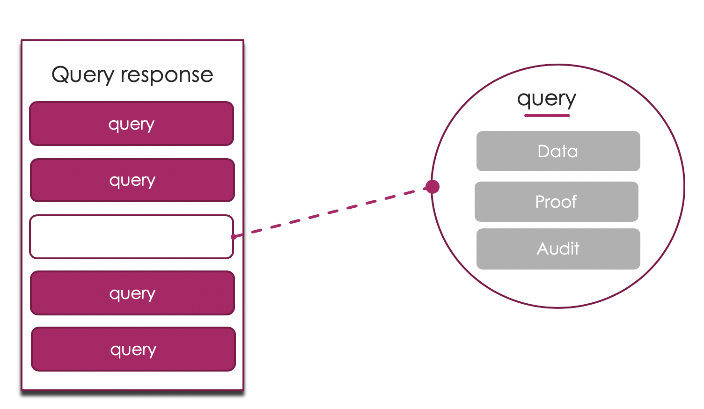

# Introducing Proxima

## What do we do?
Blockchain data is tough to truly authenticate. 
How do you know that you are getting accurate and sound data from the correct blockchain? You have no idea if the data coming from your account balance, query, or Decentralized application events are accurate and timely. The result can lead to major issues with visibility, analytics, and finances within your business. It can mean the difference between (a popping phrase for success here) or failure. 

### Examples

- Did my user pay? What are the interest rates? 
- How many users are there? What do my orders look like? 
- What is my account balance? What transactions have I been a part of?

When dealing with data security it is not enough to “trust”. Ora protocol provides the convenience, feature set, and speed of centralized providers AND maintains the audibility and trustlessness of the blockchain.

## Our goal 
Decentralize the ability to provide data, interact with data to empower DApp developers, provide tools that speed up the creation of DApps, and drive adoption of blockchain technology. Our solution is general enough to enable our decentralized data providers to provide data for DApps for several blockchains / smart contract platforms.

## How do we do it?
Ora Protocol provides default mapping of events and stores them within an authenticated data store, giving developers the ability to query this through a graphQL interface. Queries are done through a specialized node that uses an authenticated data store to provide a Merkle-proof for the query. To ensure the security of the data, Ora leaves an auditable trail for DApp developers to trace the path of their data to its source. We cannot change the authenticated data structure, so security does not have to be re-tried by each new user.

### Deployment
Deploy to our hosting DNS service through a manifest that defines data sources, contracts, and any extra mappings. This manifest is deployed to the IPNS, to enable deployment to the mesh as well as deployment to our own hosting solution. We provide default event mappings for every developer so there is no setup needed aside from listing the contract ABI code, the data source, and the address.

### Features
- Events, State
- Filtering* (soundness, not completeness), Range* (soundness, not completeness)
- Blockchain agnostic
- Trustless data 
- Performant queries

## Queries
Queries in Proxima, are given responses that are broken into entities. Each entity represents an individual data record that is being requested in the query itself. Since they are designed to be verifiable, they have components for proofs audits.

Each *entity* within a query is composed of the following attributes: 

#### Data
The data contained within each identity is associated with the schema of the entity itself. This is what the query is looking at.
#### Proof
This is the *proof-of-membership* within the Proxima Database. The Proof itself relies on the Merkle root of the database, and is authenticated with the hash of the value. 
#### Audit
The audit provides a *Proof-of-Correctness* for the entity that is being queried. This involves conducting a separate query query of data that is directly tied to the entity. For example, a transaction "audit" would return the block whose blockhash is referenced by the transaction, and a proof-of-membership for this block.

## Authenticated Datastore
Proxima uses ProximaDB, a bolt-on component of the powerful Urkel NoSQL database, that implements a Flat-File Merkle Trie (FFMT). We utilize the Flat-File Merkle Trie, like see in Urkel, because of the query speed (>1 ms), the reduced size of the proofs (>1kb), as well as the low storage footprint. FFMTs are especially useful in this implementation because they map from the internal nodes of the trie directly to the location of the data that they are referencing. For more information on this check out the [Handshake paper](https://handshake.org/files/handshake.txt).

Along with adding features like range queries and load-balancing, Ruffle provides the default authentication and performance seen in the Urkel database. Our data store provides Merkle proofs for data to ensure the authenticity and immutability of all data within it.

## Auditing 
The blocks of a blockchain are immutable, but blocks are only linked to their immediate neighbors, so the history of the blockchain can only be verified by downloading the entire chain. This means that it is only possible to audit data (e.g. transactions, state, and blocks) from a blockchain, by running a full node and synchronizing with every block in the blockchain’s history. 

### TODO diagrams

Our system maintains the same auditing structure of blockchains, but it stores blocks within an authenticated database, so it is possible to verify membership of blocks without downloading the entire history. This enables fast and efficient audits like:

### Example Audits

- Is this block a part of the Ethereum block? 
- Is this transaction really embedded in this block?
- Is this state located in the state trie for the current block?

Audits like these can be called within a query to guarantee that the information provided is correct. Audits can also be chained together in a recursive manner, this is known as an audit trail. As our product progresses, audits can be updated and added to improve the security and rigor of the audit itself. 

Audits and audit trails would take a lot of time if they are used for every query. Since the database is authenticated, probabilistic audits can be used by developers in instances where there is a high amount of overlap between queries. This lowers the number of audits needed to be completed for highly used sets while maintaining developer security guarantees.

## Considerations

There are a variety of different security considerations that must be addressed within Proxima. 

- ### Data needs to be verified

- ### Verification functions and libraries must be consistent

- ### Audits can be fooled if they simply check equality

- ### Ordering of updates and synchronization for the data structure

- ### Lazy verification from clients

- ### Anchoring of data structures

- ### What occurs in the instance of a fork?

- ### Sending bad data, validating from the incorrect Merkle root, or serving stale data from correct root

- ### Proof-of-completeness for Range queries and filters

