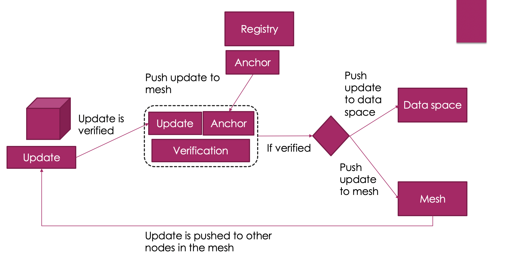
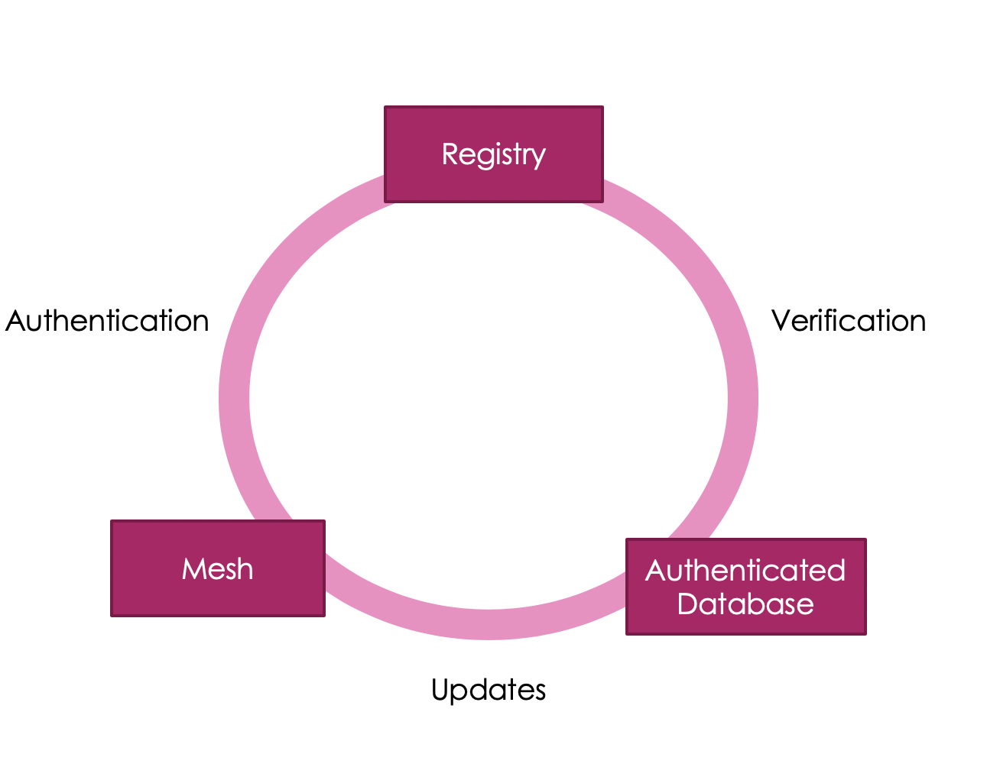
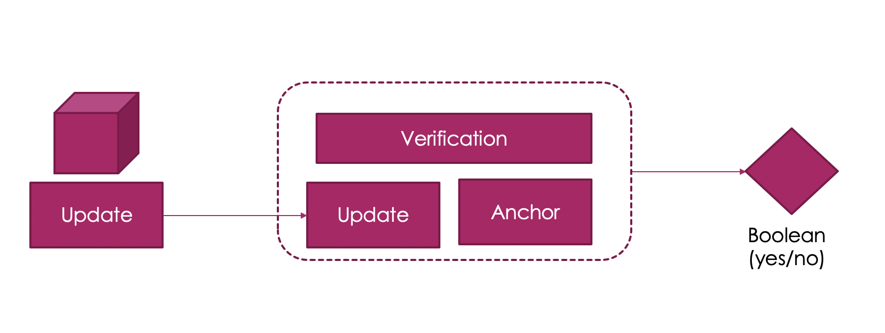

# Ora Protocol

### The data layer of web 3.0

The Ora Protocol combines authenticated datastructures and peer-to-peer topology, to enable the next generation of decentralized infrastructure. It moves away from consensus and instead anchors data spaces to static verification systems, and structuring data in an Authenticated NoSQL database. In doing this, Ora Protocol is able to change the current paradaigm from server-client, to trustless network of data sets. This has several important goals:

- *Move towards zero latency*
- *Serving data to the edge from the edge*
- *Consensusless Reads and Writes*

# Solution 
The overall solution is designed to allow the authentication of data spaces. The powerful filtering and aggregations enable data indexes to be used for many different applications.


```javascript
Ora(token: "token") {
  Index(id: "cardano") {
    anchor
    Blocks(hash: "Hash") {
      header
      Transactions {
        id
      }
    	Proof
    }
  }
}
```

- ### Blockchain Index
The first implementation of the Ora Protocol is as a blockchain index. The blocks come through an Ora Node, then filter the blocks into the respective headers, transactions, receipts, and logs. From this position, it is possible to look at state, events, and transactions themselves. 

- ### DApp Index
The DApp index represents a filter based on one or several contract addresses. Through this, it is possible to 

- ### External Data 
The  


# Features
- #### Authenticated and trustless data spaces
- #### Limitless scalability
- #### Greater security


# Anatomy of a query

```javascript
Ora(token: "token") {
  Index(id: "cardano") {
    anchor
    Blocks(hash: "Hash") {
      header
      Transactions {
        id
      }
    	Proof
    }
  }
}
```

- Registry

- [Authenticated Database]()

- Anchoring

- Authentication


# Architecture
The systems works by using three separate parts: 
- *Mesh* 
- *Authenticated Database* 
- *Registry* 



## Components



## Mesh (V1)
The mesh is the logic and communication layer for the p2p network. Through the mesh, it is possible to enable faster routing, and secure connections. This is done by establishing neighborhoods, based on proximity rather than random indexes (as seen so often with Kademlia).

> Updates are pushed from the nodes to the mesh, from the mesh they are pushed to neighboring nodes. This means that polling 
> for events are not necessary.

## Authenticated Database (V1)
The authenticated database is responsible for maintaining the structure and authentication of the data in a trustless manner. Through the authenticated database, it is possible to push queries and data to the edge without compromising security. This layer is first in its class and can maintain individual privacy through encryption of values.

## Registry (V1)
The registry is the focal point for the entire protocol. It conrls the anchors for the data spaces, and providers the authentication of the of nodes connected into the mesh. The registry of data spaces (sometimes called services), contains information on bootstraps, the id of the database, and connections to anchor points in order verify the authenticity of the data points for the space.

# Verfication and Security of data
The verification and security of data can be broken down into two different spaces: 
- *Anchoring*
- *Authentication*

## Anchoring (V1)



### Blockchain Data
The power of blockchains are that they are trustless and have methods builtin for verification or anchoring of data. This means that we can use these methods to anchor chains, and their data. 

#### Proof-of-Work 
For Proof-of-Work chains the longest chain can be found through total work, and verified through the hash of the chain.

#### Proof-of-Stake
Proof-of-State Chains can verified through the signatures, and the hash can be verified by taking the hash of the elements.

Other methods to improve verification speed including snapshotting blocks and using accumulators. 

### Accumulators and Recursive Zero Knowledge Proofs
Accumulators provide a way to anchor data, and are being used in production. Through the use of lt_hash, and other homomorphic encryption techniques it becomes fast to verify blocks in the current state, and using dynamic accumulators it is possible to determine if blocks are included in the main chain. Proofs of this variety, use witnesses to establish membership of elements.[https://www.cs.purdue.edu/homes/ninghui/papers/accumulator_acns07.pdf](https://www.cs.purdue.edu/homes/ninghui/papers/accumulator_acns07.pdf). Using recursive zero knowledge proofs with the genesis block, it is possible to prove that a block is in a blockchain. This works with both types of blockchain and is seen in such projects as Corda. 

### Signatures and Consensus for Off-chain Data
Signatures involve the owner(s) of a data space, signing updates in order to give the mesh the ability to verify. In most cases these will be external data sources, but initially blockchains might use signatures as a way for fast verification. 

- *Signatures*
- *Threshold Signatures*
- *BLS Signatures*

##### Access control lists 
Instead of having a single governing entity, it is possible to give different members different accesses and verify these. Using this method, transaction throughput and data ownership go hand-in-hand.

## Authentication (V1)
The authentication of members of the mesh, and overlay network can be done in several ways, but the current version will support two forms of authentication. Both of these forms of authentication assume each party has an associated public and private key.

### Smart contract-based Authentication
Smart contract-based authentication involves using a smart contract to mint API/authentication tokens. These tokens will be represented as events, with the smart contract referenced in the registry itself. This enables for secure and trustless creation of authentication tokens.  

```javascript
event(address, address, key, id)
```

### Signature-based Authentication
The signature-based authentication scheme is quite similar to traditional signature tokens. With the owner(s) signing a token associated with the public key of the sender.

```javascript
(address, key, id, signature)
```
