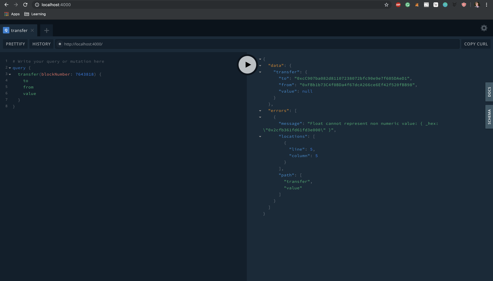

# Tutorial

## Installation

```
git clone https://github.com/chasesmith95/meshcache.git
cd /meshcache/ora-protocol-cli/
```

## Example Usage

### Initialize
```
ora-protocol init
```

Output 

```
Initializing a new project.... 
.... 
.... 
.... 
Completed
```


#### Include ABI Code
You can include the raw text of the ABI code.


#### Update Config

For now we look at the config.yml


```yaml
name: [YOUR Name]
abi: ./abi/idex_abi.json
contract: '0x2a0c0DBEcC7E4D658f48E01e3fA353F44050c208'
datasource: Ethereum
id: ID
owner: Owner
```

### Build
```
ora-protocol build
```

```
Building.... 
event SetOwner
event Order
event Cancel
event Trade
event Deposit
event Withdraw
Saved!
Saved!
```


## Start
```
ora-protocol start
```

```
Starting the node.... 
Server is running on http://localhost:4000
```





## Deploy
```
ora-protocol deploy
```
